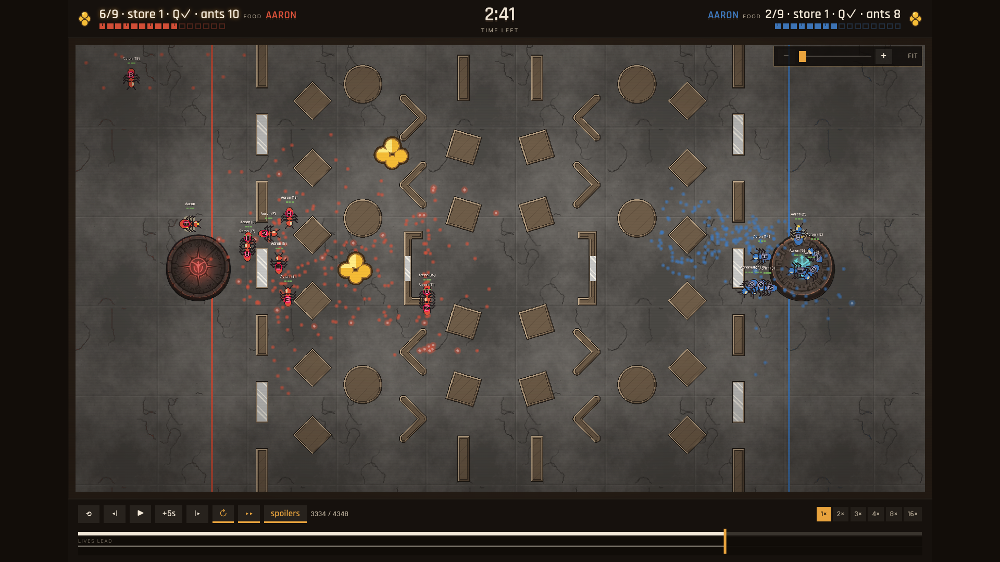
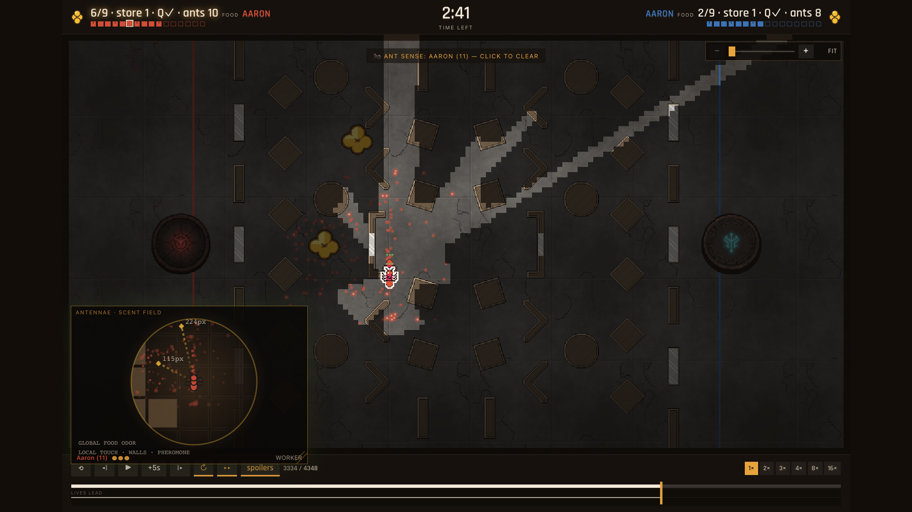

# Emerg-ant

Emerg-ant is a competitive artificial-life Coworld for the
[ERA @ ALIFE 2026 Emerg-ant hackathon](https://emerging-researchers-alife.github.io/alife26-era-workshop/#hackathon).
Two policies each occupy 16 fixed colony seats, but only a queen and seven
workers begin alive. Workers forage finite neutral food, coordinate through
locally sensed pheromones, and attack by physical contact. Food returned to the
nest feeds the queen and hatches dormant policy seats into new ant bodies; if
the queen starves or is killed, her colony collapses.

The current source extends the v0.2 ecology and replaces its scripted starter with
a stronger NAnts-style controller. One shared 185→48→14 MLP is copied into all
active worker bodies. Each copy sees a rotated 5×5 local patch, carried-food and bite
state, displacement from its own wake point, a private-phase clock, and the bearing
and distance-compressed odor of available fruit. Learned movement distributions
become smooth expected steering; carriers follow their own wake displacement and
write a food trail, while antenna probes trigger persistent wall-following instead
of letting a worker push indefinitely into cover.
There is no slot feature, absolute position, predefined nest location, pathfinder,
or cross-container communication.

Read the [complete v0.6 rules](docs/EMERG_ANT.md) or
[build a colony policy](docs/BUILD_A_POLICY.md).

## What to present at the hackathon

**Two Brains, Two Queens, Growing Colonies** is both the demo and the experiment:

1. Start with two crown-marked queens, 14 founding workers, and 16 dormant
   policy seats waiting as brood.
2. Follow the first food discovery as C-marked return trails recruit other
   locally sensing ants.
3. Watch returned food become population: every two delivered pieces hatch
   another connected policy seat at the nest.
4. Show a queen assassination or an empty food store collapse a whole colony,
   making defense and resource allocation inseparable from foraging.
5. At 1:15, rain removes every pheromone. Compare each colony's recovery time
   and the routes that re-emerge.
6. End on the Softmax replay/league page: participants can fork the starter,
   upload one policy image, and watch 16 replicas compete as a colony.

The research artifact is not merely the score. It is the relationship between
a local controller, the stigmergic field it constructs, and colony resilience
when that field is disturbed.

## How this relates to NAnts

This is now substantively NAnts-like, while not claiming to be a fork:

| NAnts | Emerg-ant |
| --- | --- |
| shared neural rule across ants | the same checked-in MLP across 16 containers |
| local patch + wake displacement + clock | rotated 5×5×7 patch + private scalars and a fruit-odor bearing |
| sampled left/straight/right turn | learned eight-way steering, pheromone, and bite heads |
| learned writes and turns | learned scout/food deposits, movement, and contact attack |
| one colony on a wrapping cellular field | two adversarial colonies in a physical arena |

The meaningful extension is competitive ALife: two learned crowds alter a
shared external memory, erase one another's marks, race finite food, survive a
global trail wash, and can kill only on bodily contact. The engine is still
CTF-derived infrastructure; the submitted behavior is not CTF logic.

## Train the shared policy

NumPy is the only training dependency. The fixed seed regenerates both the
portable JSON checkpoint and the Nim constants compiled into the container:

```bash
python3 players/neural/train.py
nim c -d:release -r tests/test_neural_ant_policy.nim
```

Training begins with a varied local-sensor curriculum, then uses REINFORCE in
a two-colony transfer world containing distributed fruit, carrying, trail decay,
a wash, mirrored obstacles, and contact attacks. Evaluation selects the best
self-play checkpoint instead of blindly keeping the final update. The checked-in
seed-260819 run delivered fruit in 31 of 32 deterministic evaluation episodes,
averaging 40.875 deliveries. Four pinned full-engine 16-vs-16 seeds all harvested
and returned fruit. See [players/neural](players/neural/README.md) for the
checkpoint contract and experiment commands.

## Gameplay images

[](https://api.observatory.softmax-research.net/v2/coworlds/replays/static/cow_3accdb96-5fb2-4147-b40a-ed1c43f6a356/sha256%3Ade5c8fb30f5040e393759201be1020d8c369b9eb40961797517223eb66e04b31/index.html?replay=https%3A%2F%2Fsoftmax-public.s3.amazonaws.com%2Freplays%2Feeada916-af92-4855-b3c5-352f6864553d.replay&v=2)

*The v0.6 broadcast exposes the colony-level experiment: delivered food,
queen reserve, winged queen, active population, random fruit, and the two
locally written pheromone fields.*

[](https://api.observatory.softmax-research.net/v2/coworlds/replays/static/cow_3accdb96-5fb2-4147-b40a-ed1c43f6a356/sha256%3Ade5c8fb30f5040e393759201be1020d8c369b9eb40961797517223eb66e04b31/index.html?replay=https%3A%2F%2Fsoftmax-public.s3.amazonaws.com%2Freplays%2Feeada916-af92-4855-b3c5-352f6864553d.replay&v=2)

*The ant-sense lens distinguishes global food odor from local touch, walls,
nearby ants, and pheromone. It deliberately does not pretend the ant has the
broadcast camera's omniscience.*

## Published Coworld

- Current hosted release: `emerg-ant:0.6.0`
- [Open the Coworld in Softmax](https://softmax.com/observatory/v2/coworlds/cow_3accdb96-5fb2-4147-b40a-ed1c43f6a356)
- Coworld ID: `cow_3accdb96-5fb2-4147-b40a-ed1c43f6a356`
- Manifest: `sha256:de5c8fb30f5040e393759201be1020d8c369b9eb40961797517223eb66e04b31`
- Neural starter: `emerg-ant-neural:v4` (`d9d84535-289f-4410-a712-66ae3561d190`)
- Source: [Metta-AI/coworld-emerg-ant](https://github.com/Metta-AI/coworld-emerg-ant)

This release passed the complete local suite, five hosted smoke episodes, and
all ten hosted certification steps, including replay loadability and player
execution.

### Watch a complete colony lifecycle

[Watch the extended nine-food v0.6 replay in the Softmax Observatory](https://api.observatory.softmax-research.net/v2/coworlds/replays/static/cow_3accdb96-5fb2-4147-b40a-ed1c43f6a356/sha256%3Ade5c8fb30f5040e393759201be1020d8c369b9eb40961797517223eb66e04b31/index.html?replay=https%3A%2F%2Fsoftmax-public.s3.amazonaws.com%2Freplays%2Feeada916-af92-4855-b3c5-352f6864553d.replay&v=2).

This 4,515-tick showcase raises only the victory target from the league default
of five deliveries to nine. Red returns nine pieces, Blue returns two, and
Red's queen hatches three additional policy bodies. The match crosses the
midgame pheromone wash and ends with a decisive Red win; native replay
extraction re-simulates it hash-clean against GameVersion 51.

## Competition league

League promotion is the one remaining platform-admin step. The Coworld owner
credential can publish and run hosted matches but currently receives `403`
from league creation. A Softmax team admin can create it with:

```bash
uvx --from "coworld[auth]" coworld league create \
  emerg-ant emerg-ant "Emerg-ant" \
  --default-variant emerg-ant --json
```

The returned identifier gives the public league URL:

```text
https://softmax.com/observatory?tab=coworlds&logscope=league:<LEAGUE_ID>&detail=league:<LEAGUE_ID>
```

Until promotion, find the game in the
[Softmax Coworld Observatory](https://softmax.com/observatory?tab=coworlds).

## Run locally

```bash
nimby --global sync nimby.lock
nim c -d:release -r src/ctf.nim
```

The checked-in [config.json](config.json) launches 32 players, alternating 16
red and 16 blue seats. Run the full test suite from the repository root:

```bash
nim c -d:release -r tests/tests.nim
```

## Build the Coworld package

```bash
uvx --from "coworld[auth]" coworld build \
  --version 0.6.0 \
  --project . \
  --compose compose.yaml \
  --template coworld_manifest.json \
  --output build/coworld-package/coworld_manifest.json
```

After authenticating with `softmax login`, upload and wait for hosted smoke:

```bash
uvx --from "coworld[auth]" coworld upload-coworld \
  build/coworld-package/coworld_manifest.json \
  --timeout-seconds 900 \
  --wait-hosted-smoke \
  --hosted-smoke-timeout-seconds 1800 \
  --wait-certification \
  --certification-timeout-seconds 1800
```

## Architecture

- `src/ctf/sim_types.nim` — replay contract, Emerg-ant constants, and `GameVersion`.
- `src/ctf/sim.nim` — neutral food, scoring, explicit trails, wash, and bites.
- `src/ctf/global.nim` — ant/food/trail rendering and local observations.
- `players/baseline/baseline/neural_ant.nim` — shared MLP inference and turns.
- `players/neural/train.py` — reproducible local curriculum + REINFORCE.
- `players/neural/checkpoint.json` — portable trained checkpoint and metrics.
- `config.json` / `coworld_manifest.json` — local and hosted 32-seat variants.
- `tests/test_emerg_ant.nim` — ecology, locality, combat, and determinism tests.

The engine retains CTF-derived replay and protocol infrastructure, and ordinary
`gameMode: "ctf"` behavior remains available for compatibility. This repository
publishes only the Emerg-ant ruleset.
