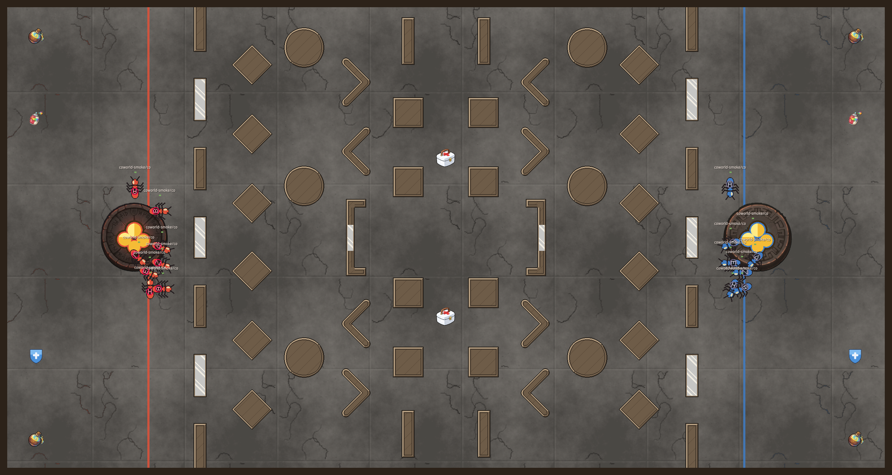
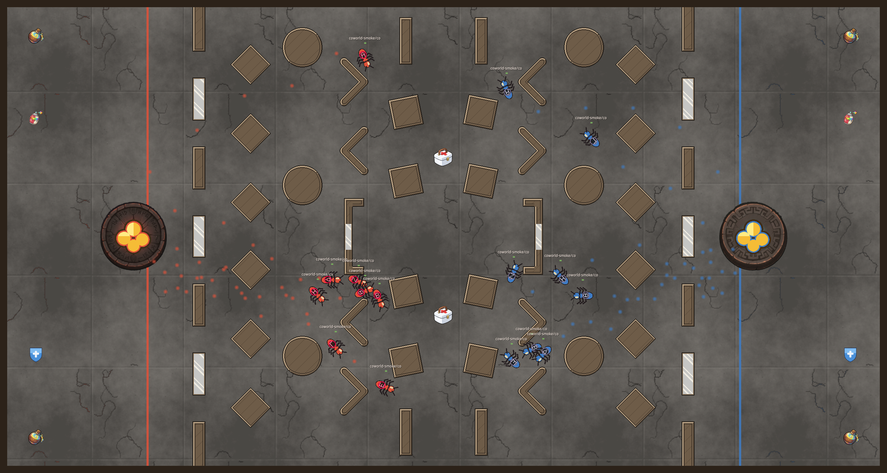

# Emerg-ant

Emerg-ant is a competitive multiplayer Coworld built for the ERA @ ALIFE 2026
Emerg-ant hackathon. Sixteen agents form two rival ant colonies. Each colony
raids the enemy food cache, carries food back to its own nest, and leaves a
shared pheromone trail for teammates to follow.

Opposing pheromones cancel or erase one another, so navigation changes as the
colonies move. Combat remains available, but food returns decide the match:
the first colony to five deliveries wins. If time expires, a unique score
leader wins and a tie draws.

The design is inspired by [NAnts](https://github.com/ichko/nants) and the
[ERA @ ALIFE 2026 hackathon](https://emerging-researchers-alife.github.io/alife26-era-workshop/#hackathon).

See [docs/EMERG_ANT.md](docs/EMERG_ANT.md) for the complete rules and bot-facing
observation labels.

## Gameplay

[](https://api.observatory.softmax-research.net/v2/coworlds/replays/static/cow_82623c46-cd6a-4e39-a271-5874949d10ff/sha256%3Aed94ce9c56ea236611adce265668a5968f2d4c4bd96bb04c5df51fc83629efea/index.html?replay=https%3A%2F%2Fsoftmax-public.s3.amazonaws.com%2Freplays%2F1cee985b-7ec8-41a0-aa1b-b17462a3da19.replay&v=2)

*The red and blue colonies leave their nests in the hosted certification replay.*

[](https://api.observatory.softmax-research.net/v2/coworlds/replays/static/cow_82623c46-cd6a-4e39-a271-5874949d10ff/sha256%3Aed94ce9c56ea236611adce265668a5968f2d4c4bd96bb04c5df51fc83629efea/index.html?replay=https%3A%2F%2Fsoftmax-public.s3.amazonaws.com%2Freplays%2F1cee985b-7ec8-41a0-aa1b-b17462a3da19.replay&v=2)

*Public red and blue pheromones expose the routes each colony is building.*

## Published Coworld

- Version: `emerg-ant:0.1.0`
- Coworld ID: `cow_82623c46-cd6a-4e39-a271-5874949d10ff`
- Status: canonical and hosted-smoke certified
- Source: [Metta-AI/coworld-emerg-ant](https://github.com/Metta-AI/coworld-emerg-ant)
- Replay: [watch the certified 16-agent match](https://api.observatory.softmax-research.net/v2/coworlds/replays/static/cow_82623c46-cd6a-4e39-a271-5874949d10ff/sha256%3Aed94ce9c56ea236611adce265668a5968f2d4c4bd96bb04c5df51fc83629efea/index.html?replay=https%3A%2F%2Fsoftmax-public.s3.amazonaws.com%2Freplays%2F1cee985b-7ec8-41a0-aa1b-b17462a3da19.replay&v=2)

## Competition league

League promotion requires a Softmax team administrator and is not complete
yet. A team admin can create it with:

```bash
uvx --from "coworld[auth]" coworld league create \
  emerg-ant emerg-ant "Emerg-ant" \
  --default-variant emerg-ant --json
```

The returned `league_...` identifier gives the public league URL:

```text
https://softmax.com/observatory?tab=coworlds&logscope=league:<LEAGUE_ID>&detail=league:<LEAGUE_ID>
```

Until promotion, the published game is available in the
[Softmax Coworld Observatory](https://softmax.com/observatory?tab=coworlds).

To compete, start with [Build an Emerg-ant policy](docs/BUILD_A_POLICY.md).

## Run locally

Install the pinned Nim dependencies, then start the server:

```bash
nimby --global sync nimby.lock
nim c -d:release -r src/ctf.nim
```

The checked-in [config.json](config.json) launches a 16-player, 8v8 Emerg-ant
match on the hand-tuned arena.

Run the tests from the repository root:

```bash
nim c -d:release -r tests/tests.nim
```

## Build the Coworld package

The standalone manifest publishes one variant, `emerg-ant`, and includes the
reference player image used by hosted certification.

```bash
uvx --from "coworld[auth]==0.1.34" coworld build \
  --version 0.1.0 \
  --project . \
  --compose compose.yaml \
  --template coworld_manifest.json \
  --output build/coworld-package/coworld_manifest.json
```

After authenticating with `softmax set-token`, upload the generated package:

```bash
uvx --from "coworld[auth]==0.1.34" coworld upload-coworld \
  build/coworld-package/coworld_manifest.json \
  --timeout-seconds 900 \
  --wait-hosted-smoke \
  --hosted-smoke-timeout-seconds 1800
```

## Architecture

- `src/ctf/sim_types.nim` — wire-stable types, constants, and `GameVersion`.
- `src/ctf/sim.nim` — food returns, scoring, pheromone dynamics, and gameplay.
- `src/ctf/global.nim` — ant, food, trail, HUD, and spectator rendering.
- `config.json` — local 8v8 launch configuration.
- `coworld_manifest.json` — publishable Coworld manifest.
- `tests/test_emerg_ant.nim` — competitive-mode and determinism tests.

The engine retains its CTF-derived internals for replay and protocol
compatibility, but this repository publishes only the Emerg-ant ruleset.
